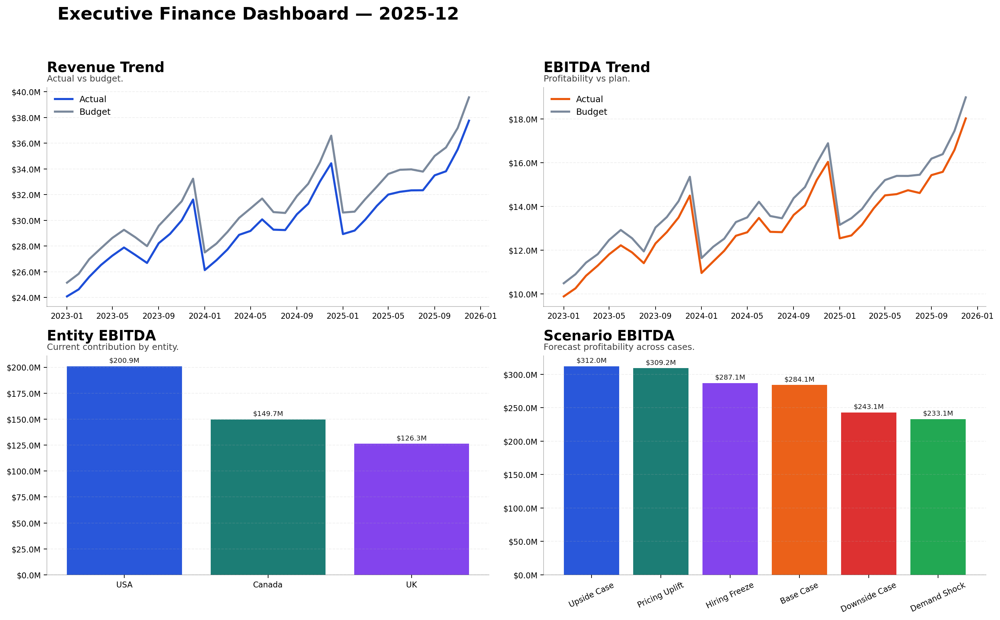
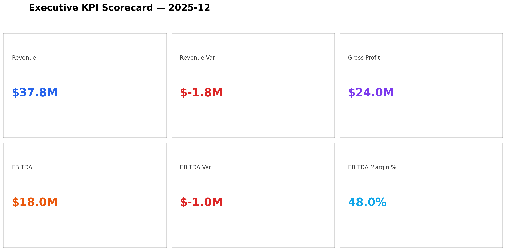
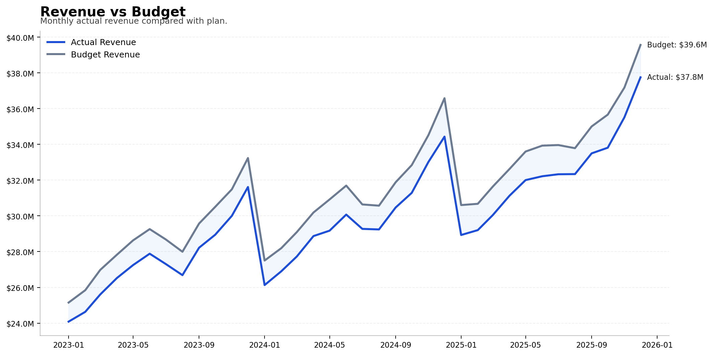
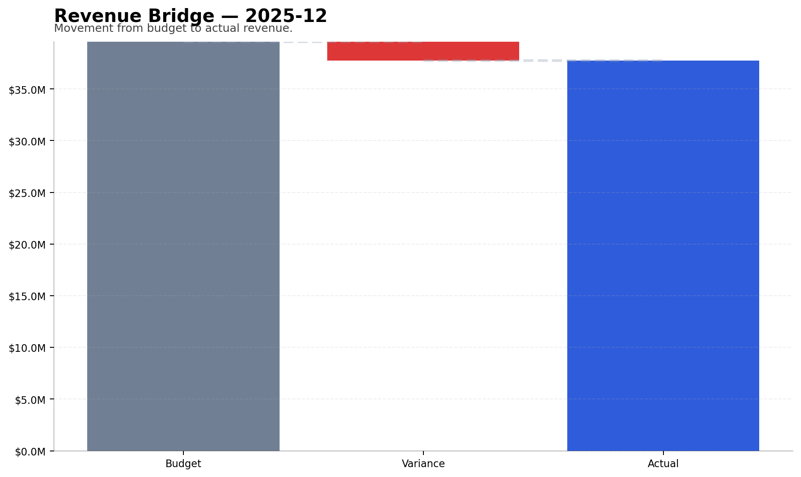
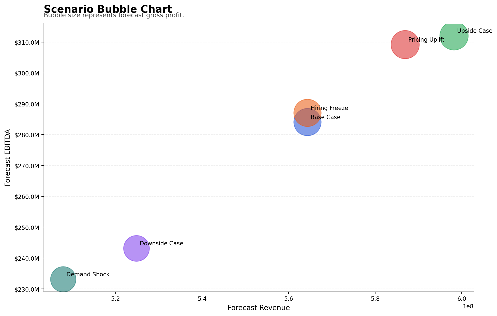
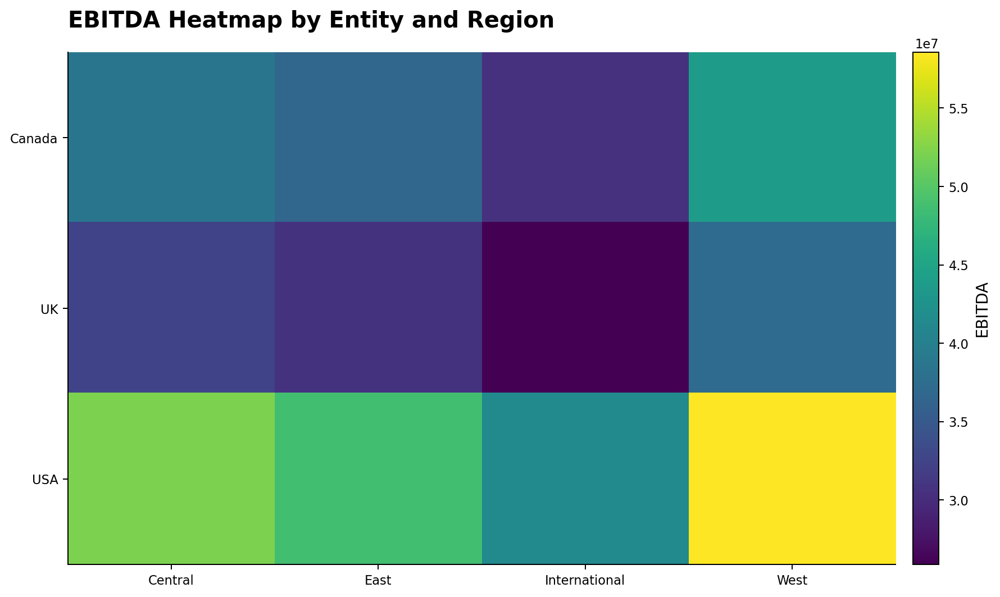
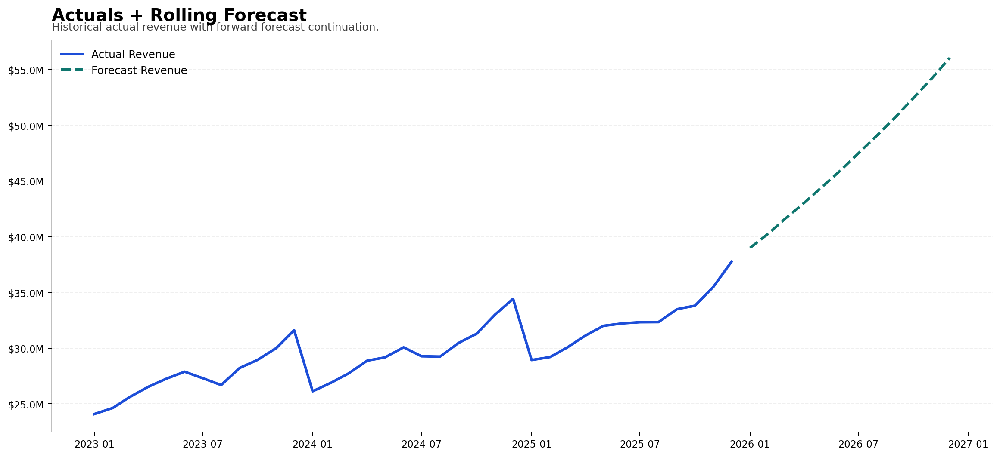
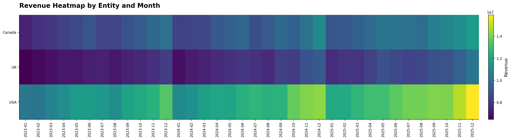

[](https://enterprise-fpna-decision-engine-t5n4euajzwyzfa7nrym8ls.streamlit.app/)


# Enterprise FP&A Decision Engine

An end-to-end FP&A analytics project that simulates a real-world corporate finance environment using Python, SQL, DuckDB, forecasting, scenario modeling, automated commentary, executive dashboards, and an interactive Streamlit application.

This project demonstrates how a modern FP&A function can automate reporting, forecasting, and decision support using scalable data workflows.

---

# Overview

Finance teams often spend significant time manually preparing:

- Monthly reporting packs  
- Budget vs actual variance analysis  
- Rolling forecasts  
- Scenario planning  
- Department spend reviews  
- KPI dashboards  
- Executive commentary  

This project converts that process into a fully automated pipeline.

It generates synthetic multi-entity finance data, validates it, builds reporting tables, creates forecasts and scenarios, and produces executive-ready dashboards and visuals — along with an interactive Streamlit dashboard for exploration.

---

# What This Project Does

## Finance Data Simulation
- Generates 36 months of finance data  
- Multi-entity and multi-region structure  
- Revenue, COGS, Opex, Headcount, Working Capital  
- Budget vs Actual layers  

## FP&A Reporting
- Monthly P&L dataset  
- Revenue analysis  
- Gross margin tracking  
- Opex breakdown  
- EBITDA analysis  
- Entity and region performance  

## Forecasting & Planning
- Rolling 12-month forecast  
- Trend-based forecasting logic  
- Scenario comparison (upside/downside)  
- Profitability impact modeling  

## Executive Decision Support
- KPI scorecards  
- Executive dashboards  
- Revenue and EBITDA bridges  
- Variance commentary  
- Scenario visuals  
- Department overspend analysis  

## Interactive Dashboard (Streamlit)
- Entity and region filters  
- KPI cards  
- Revenue vs budget trends  
- EBITDA vs budget trends  
- Scenario selector  
- Forecast comparison charts  
- Department cost analysis  
- Commentary explorer  
- Data explorer  

---

# Business Questions Answered

This project helps answer practical FP&A questions:

- Which entity is driving EBITDA performance?
- Where are we missing budget?
- Which departments are overspending?
- How does forecast change under different scenarios?
- What drives margin expansion?
- How can reporting be automated?
- How does profitability change under different planning assumptions?

---

# Tech Stack

- Python  
- Pandas  
- NumPy  
- Matplotlib  
- Streamlit  
- DuckDB  
- SQL  
- Git / GitHub  

---

# Project Structure

```
enterprise-fpna-decision-engine/
│
├── data/
│   ├── raw/
│   ├── processed/
│   └── master_data/
│
├── output/
│   ├── charts/
│   ├── reports/
│   └── logs/
│
├── sql/
│
├── src/
│   ├── generate_data.py
│   ├── validate.py
│   ├── transform.py
│   ├── forecast.py
│   ├── scenario.py
│   ├── metrics.py
│   ├── commentary.py
│   ├── charts.py
│
├── streamlit_app.py
├── main.py
├── requirements.txt
└── README.md
```

---

# End-to-End Pipeline

```
Synthetic Data
     ↓
Validation
     ↓
Transformation
     ↓
SQL Reporting Layer
     ↓
Rolling Forecast
     ↓
Scenario Modeling
     ↓
KPI Tables
     ↓
Executive Visuals
     ↓
Interactive Streamlit Dashboard
```

---

# Interactive Dashboard

The project includes a fully interactive FP&A dashboard built with Streamlit.

https://enterprise-fpna-decision-engine-t5n4euajzwyzfa7nrym8ls.streamlit.app/

### Dashboard Features

- Entity filtering  
- Region filtering  
- Scenario selection  
- KPI summary cards  
- Revenue vs Budget trend  
- EBITDA vs Budget trend  
- Entity performance comparison  
- Region margin analysis  
- Forecast vs Scenario comparison  
- Department Opex variance  
- Commentary viewer  
- Data explorer  

---

# Running the Interactive Dashboard

First generate the data:

```
python main.py
```

Then launch the dashboard:

```
streamlit run streamlit_app.py
```

The dashboard will open in your browser.

---

# Key Outputs

## Reporting
- Monthly P&L  
- Revenue summary  
- Opex summary  
- Headcount summary  
- Working capital metrics  

## Forecasting
- Rolling 12-month forecast  
- Scenario comparison  
- Forecast entity summary  

## Executive Outputs
- KPI scorecard  
- Executive dashboard  
- Revenue vs budget chart  
- EBITDA vs budget chart  
- Revenue bridge  
- EBITDA bridge  
- Scenario bubble chart  
- Department overspend Pareto  

## Interactive App
- Fully interactive FP&A dashboard  
- Real-time filtering  
- Scenario selection  
- Live KPI updates  
- Executive-ready visuals  

---

# Example Visuals

## Executive Finance Dashboard


## Executive KPI Scorecard


## Revenue vs Budget


## Revenue Bridge


## Scenario Bubble Chart


## EBITDA Heatmap by Entity and Region


## Actual + Rolling Forecast


## Revenue Heatmap by Entity and Month


---

# How to Run

Install dependencies:

```
pip install -r requirements.txt
```

Run full pipeline:

```
python main.py
```

Launch interactive dashboard:

```
streamlit run streamlit_app.py
```

Outputs will be generated in:

```
output/
```

---

# Example Deliverables

After running the pipeline, the project produces:

- Processed finance datasets  
- Forecast outputs  
- Scenario comparisons  
- KPI tables  
- Executive dashboards  
- Management charts  
- Commentary files  
- Interactive Streamlit dashboard  

---

# Author

Md Siddik, ACCA  
Senior Financial Analyst / FP&A  
Vancouver, Canada